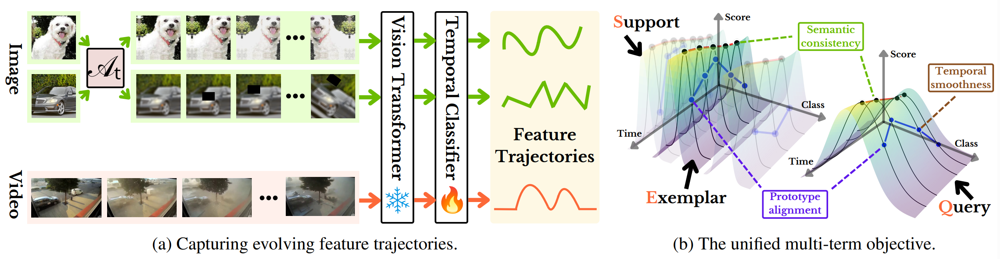

<div align="center">
  <h1 style="display: flex; align-items: center; justify-content: center; gap: 15px; margin: 0;">
    Learning Time in Static Classifiers
  </h1>

<a href="https://darcyddx.github.io/files/AAAI26_Learning_Time_in_Static_C.pdf" target="_blank"></a><a href="https://darcyddx.github.io/seq/"></a><a href="https://arxiv.org/abs/2511.12321" target="_blank"></a>

[Xi Ding](https://darcyddx.github.io/), [Lei Wang](https://leiwangr.github.io/), [Piotr Koniusz](https://www.koniusz.com/), [Yongsheng Gao](https://experts.griffith.edu.au/19112-yongsheng-gao)
</div>

## Citation
```bibtex
@inproceedings{ding2026learning,
  title={Learning Time in Static Classifiers},
  author={Ding, Xi and Wang, Lei and Koniusz, Piotr and Gao, Yongsheng},
  booktitle={Proceedings of the AAAI Conference on Artificial Intelligence},
  year={2026}
}
```

## Overview

<p style="font-size: 1.8rem; line-height: 1.7;">
  We present a framework for learning <strong>temporal patterns in videos</strong> by modeling how <em style="color:#6a5acd;">visual features evolve over time</em>. Temporally smooth video sequences are processed by a <strong>frozen image pretrained vision transformer</strong> to extract frame level features, and a lightweight temporal classifier learns feature trajectories across frames. These trajectories are optimized under the <em style="color:#2e8b57;">Support Exemplar Query learning framework</em> to achieve accurate classification and maintain <em>smooth and consistent temporal evolution</em>.
</p